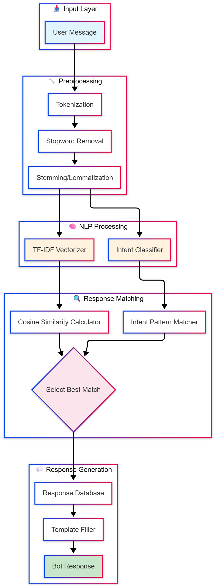
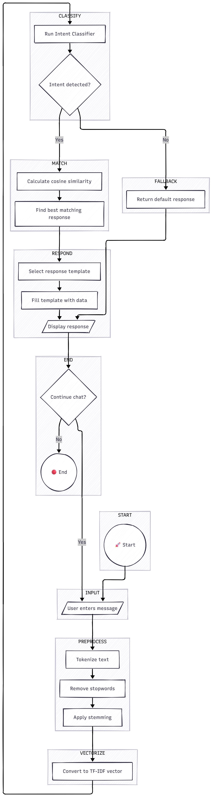

# Hybrid Intent-Based Chatbot

A hybrid chatbot combining TF-IDF vectorization with intent classification for intelligent response generation.

## 🛠️ Technologies

- **NLP Libraries**: NLTK, scikit-learn
- **ML Algorithm**: TF-IDF Vectorization + Cosine Similarity
- **Classification**: Intent Recognition Model
- **Language**: Python 3.x

## 📋 Features

- TF-IDF based text similarity matching
- Intent classification for query understanding
- Hybrid response generation (retrieval + rule-based)
- Customizable intent patterns

## 🏗️ Architecture
User Input → Preprocessing → TF-IDF Vectorization
↓
Intent Classification
↓
Response Selection (Cosine Similarity)
↓
Bot Response







## 🚀 Installation
```bash
# Clone the repository
git clone https://github.com/MohdSarar/Chatbot-hybrid.git
cd Chatbot-hybrid

# Install dependencies
pip install nltk scikit-learn numpy

# Download NLTK data
python -c "import nltk; nltk.download('punkt'); nltk.download('stopwords')"
```

## 💡 Usage
```bash
python chatbot.py
```

## 📊 Model Details

| Component | Method |
|-----------|--------|
| Text Vectorization | TF-IDF |
| Similarity Measure | Cosine Similarity |
| Intent Detection | Classification Model |

## 👤 Author

**Mohammed ABUSARAR** - [GitHub](https://github.com/MohdSarar)